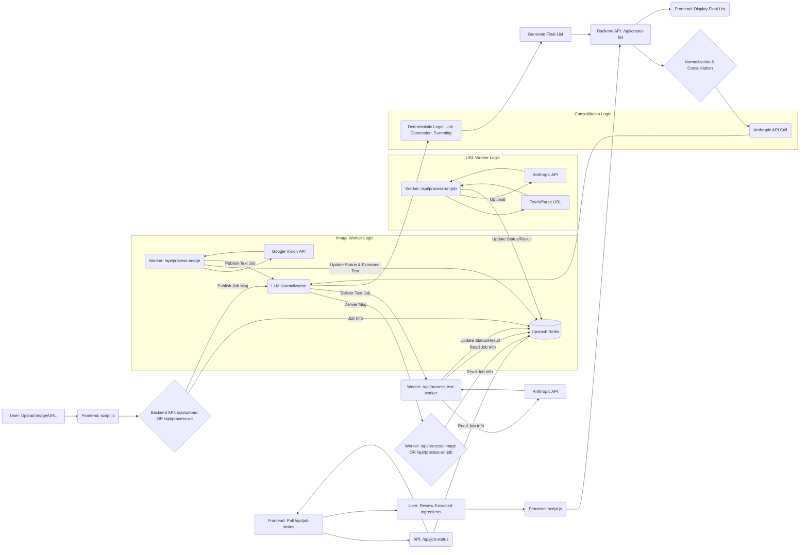

# Recipe-to-Cart: Project Overview

## 1. Project Goal

The primary goal of this application is to allow users to easily convert recipes from various sources (images, URLs) into a consolidated, normalized shopping list suitable for import into grocery platforms or personal use. It aims to handle variations in ingredient descriptions, units, and quantities to produce a sensible, combined list.

## 2. Core Workflow

1.  **Input:** User uploads one or more recipe images OR pastes a recipe URL.
2.  **Initial Processing (Frontend):**
    *   Images: Display previews (if possible).
    *   URLs: Minimal validation.
3.  **Backend Trigger:** Frontend sends image data or URL to the backend (`/api/upload` or `/api/process-url`).
4.  **Asynchronous Job Kick-off (Backend + QStash):**
    *   The backend endpoint (`/api/upload` or `/api/process-url`) receives the request, stores initial job state in **Upstash Redis**, and immediately publishes a message to **Upstash QStash** specifying the appropriate background worker (`/api/process-image` or `/api/process-url-job`) and the `jobId`.
    *   The endpoint returns `202 Accepted` with the `jobId` to the frontend.
5.  **Background Worker Execution (QStash -> Backend):**
    *   QStash reliably delivers the message (with retries if necessary) to the designated worker endpoint (`/api/process-image` or `/api/process-url-job`).
    *   The worker endpoint verifies the QStash signature.
    *   **Image Worker (`/api/process-image`):** Fetches job details from Redis, downloads image from Blob, performs OCR (Vision API), updates Redis status (`vision_completed`), and publishes *another* message to QStash targeting the text analysis worker (`/api/process-text-worker`).
    *   **URL Worker (`/api/process-url-job`):** Fetches job details from Redis, scrapes/parses the URL, potentially calls an LLM for initial extraction, and updates Redis status (`completed` or `failed`).
    *   **Text Worker (`/api/process-text-worker`):** (Triggered by image worker) Fetches job details (including OCR text) from Redis, calls Anthropic for ingredient parsing, and updates Redis status (`completed` or `failed`).
6.  **Status Polling & Result Display (Frontend <-> Backend):**
    *   The frontend polls `/api/job-status` using the `jobId`.
    *   `/api/job-status` reads the current job status and results/error directly from **Upstash Redis**.
    *   Extracted ingredients (or errors) are displayed per recipe source in the "Extracted Recipes" section.
7.  **Review & Consolidation Trigger (Frontend -> Backend):**
    *   User reviews the extracted ingredients, potentially making minor adjustments (like unchecking pantry items).
    *   User clicks "Review Final List".
    *   Frontend sends the collected (potentially modified) ingredient data from all sources to the `/api/create-list` endpoint.
8.  **Normalization & Consolidation (Backend):**
    *   The `/api/create-list` endpoint receives the raw ingredient list.
    *   **Normalization (V8 Hybrid Approach):** It calls the Anthropic API (Claude Haiku) to get a `normalized_name`, `quantity`, and `unit` for each ingredient string.
    *   **Consolidation:** It uses deterministic logic to:
        *   Convert parsed units to canonical forms (`getCanonicalUnit`).
        *   Convert quantities to target units based on ingredient type (`conversionFactors`, `targetPrimaryUnits`).
        *   Sum quantities for ingredients with the same `normalized_name`.
        *   Apply final adjustments (rounding, minimums, secondary units like lbs for garlic heads).
9.  **Final List Display (Backend -> Frontend):**
    *   The backend responds with the final, consolidated list (`processedIngredients`).
    *   The frontend displays this final shopping list to the user.

## 3. Technology Stack

*   **Frontend:** Vanilla HTML, CSS, JavaScript (`frontend/index.html`, `frontend/style.css`, `frontend/script.js`)
*   **Backend:** Node.js with Express (`backend/server.js`)
*   **Asynchronous Task Queue:** Upstash QStash
*   **Job State Management:** Upstash Redis
*   **Temporary File Storage:** Vercel Blob
*   **Text Extraction (OCR):** Google Cloud Vision API
*   **Ingredient Normalization/Parsing:** Anthropic Claude API (Haiku model)
*   **Deployment:** Vercel (Targeted)

## 4. Project Structure

```
.
├── backend/
│   ├── controllers/      # Request handlers for API routes (listController.js, etc.)
│   ├── services/         # Clients for external APIs (googleVisionService.js, anthropicService.js)
│   ├── utils/            # Helper functions (jsonUtils.js)
│   ├── server.js         # Express server setup, middleware, route definitions
│   └── ...
├── frontend/
│   ├── index.html        # Main HTML structure
│   ├── script.js         # Client-side logic, API calls, UI updates
│   ├── style.css         # Styling
│   └── ...
├── .env                  # Environment variables (local) - NOT COMMITTED
├── .gitignore
├── package.json          # Project dependencies (likely combined F/E & B/E)
├── start_backend.sh      # Script to run backend locally with specific env vars
├── recipe-vision-sa-key.json # Google Service Account Key (local) - NOT COMMITTED
├── PROJECT_OVERVIEW.md   # This file
├── plan.md               # Development planning notes
└── rules.md              # Development guidelines
```

## 5. Backend API Endpoints

*   **`POST /api/upload`**
    *   **Controller:** `uploadController.js`
    *   **Purpose:** Handles uploads of recipe image files.
    *   **Action:** Saves image to Vercel Blob, stores initial job state (`pending`, `imageUrl`) in Redis, publishes a job message to **QStash** targeting `/api/process-image`.
    *   **Response:** `202 Accepted` with `{ jobId }`.
*   **`POST /api/process-url`**
    *   **Controller:** `urlController.js`
    *   **Purpose:** Handles submission of a recipe URL.
    *   **Action:** Stores initial job state (`pending`, `inputUrl`) in Redis, publishes a job message to **QStash** targeting `/api/process-url-job`.
    *   **Response:** `202 Accepted` with `{ jobId }`.
*   **`POST /api/process-image`**
    *   **Triggered By:** QStash message from `/api/upload`.
    *   **Controller:** `processImageController.js`
    *   **Purpose:** Performs OCR on the image specified in the job data.
    *   **Action:** Verifies QStash signature, fetches job data (incl. `imageUrl`) from Redis, downloads image, calls Vision API, updates Redis status (`vision_completed` or `failed`), publishes job message to **QStash** targeting `/api/process-text-worker` on success.
    *   **Response:** `200 OK` or `500` status code back to QStash.
*   **`POST /api/process-url-job`**
    *   **Triggered By:** QStash message from `/api/process-url`.
    *   **Controller:** `urlJobController.js`
    *   **Purpose:** Scrapes and parses the recipe URL specified in the job data.
    *   **Action:** Verifies QStash signature, fetches job data (incl. `inputUrl`) from Redis, fetches/parses HTML (JSON-LD/Readability), potentially calls LLM, updates Redis status (`completed` or `failed`).
    *   **Response:** `200 OK` or `500` status code back to QStash.
*   **`POST /api/process-text-worker`**
    *   **Triggered By:** QStash message from `/api/process-image`.
    *   **Controller:** `processTextWorkerController.js`
    *   **Purpose:** Parses extracted text using Anthropic API.
    *   **Action:** Verifies QStash signature, fetches job data (incl. `extractedText`) from Redis, calls Anthropic, updates Redis status (`completed` or `failed`).
    *   **Response:** `200 OK` or `500` status code back to QStash.
*   **`GET /api/job-status`**
    *   **Controller:** `jobStatusController.js`
    *   **Purpose:** Allows the frontend to poll for the status and results of a job.
    *   **Action:** Reads job data directly from **Redis** using the provided `jobId`.
    *   **Response:** JSON object containing `{ status, result?, error? }`.
*   **`POST /api/create-list`**
    *   **Controller:** `backend/controllers/listController.js`
    *   **Purpose:** Takes the raw extracted ingredients from multiple sources (provided by the frontend after user review) and performs the final normalization and consolidation.
    *   **Request Body:** `{ ingredients: [{ ingredient: string, quantity?: number, unit?: string, ... }, ...], title?: string }`
    *   **Action:** Implements the V8 Hybrid normalization/consolidation logic (Anthropic call + deterministic processing).
    *   **Response Body:** `{ processedIngredients: [{ name: string, line_item_measurements: [{ unit: string, quantity: number }, ...] }, ...], originalTitle?: string }`

## 6. Key Services & Utilities

*   **`backend/services/googleVisionService.js`:**
    *   Initializes and exports the Google Cloud Vision API client (`ImageAnnotatorClient`).
    *   Handles authentication, crucially supporting both `keyFilename` (local path) and `credentials` (JSON content from env var) based on `GOOGLE_APPLICATION_CREDENTIALS` format.
*   **`backend/services/anthropicService.js`:**
    *   Contains the logic (`callAnthropic`) to interact with the Anthropic Claude API.
    *   Handles constructing the request, making the API call, and returning the raw response, including error handling and retry logic (if implemented).
*   **QStash Integration:**
    *   **Publisher:** Code in `/api/upload`, `/api/process-url`, and `/api/process-image` uses the `@upstash/qstash` client (`Client`) to publish messages to QStash, specifying the full public URL of the target worker endpoint.
    *   **Receiver:** Middleware in the worker routes (`/api/process-image`, `/api/process-url-job`, `/api/process-text-worker`) uses `@upstash/qstash` (`Receiver`) to verify incoming webhook signatures before executing controller logic.
*   **Redis Integration:**
    *   Uses `@upstash/redis` client to `set` and `get` job status and associated data, keyed by `jobId`.
*   **`backend/utils/jsonUtils.js`:**
    *   Provides robust JSON parsing (`parseAndCorrectJson`), designed to handle potentially malformed or prefixed JSON responses from LLMs.
*   **URL Scraping (Likely in `urlJobController.js` or a dedicated utility):**
    *   Contains logic to fetch HTML content from a given URL and extract recipe ingredients, potentially using libraries like Cheerio or relying on structured data (JSON-LD) if available.

## 7. Data Flow



## 8. Core Challenges & Solutions

*   **Ingredient Normalization & Consolidation:**
    *   **Challenge:** Ingredients appear in highly variable formats ("1 lg onion", "onions, chopped", "1 cup flour", "flour for dusting"). Simple string matching is insufficient for accurate grouping and summing. Unit conversions are complex.
    *   **Solution (V8 Hybrid):**
        1.  **LLM First Pass:** Use Anthropic API (`listController.js`) to parse the raw string into `normalized_name`, `quantity`, and `unit`. This leverages the LLM's language understanding for complex variations.
        2.  **Deterministic Refinement:** Use backend code (`listController.js`) to:
            *   Apply robust unit canonicalization (`getCanonicalUnit`).
            *   Define target consolidation units (`targetPrimaryUnits`).
            *   Use hardcoded conversion factors (`conversionFactors`) for reliable math.
            *   Apply specific rounding rules (`Math.ceil` for countables) and minimums.
            *   Handle fallback scenarios gracefully (using cleaned raw string if LLM fails normalization).
        *   **Rationale:** This balances the LLM's parsing strength with the reliability of code for math and business rules (Ref: `rules.md` Guideline #3).
*   **Asynchronous Processing:**
    *   **Challenge:** Calling external APIs (Vision, Anthropic, URL scraping) can be slow, blocking the request thread and potentially leading to timeouts or poor user experience, especially on serverless platforms.
    *   **Solution:** Use **Upstash QStash** as a reliable message queue for *all* asynchronous steps. Trigger endpoints (`/upload`, `/process-url`) immediately publish a job message to QStash and return `202 Accepted`. QStash guarantees delivery of the message to the appropriate backend worker endpoint (`/process-image`, `/process-url-job`). The image worker (`/process-image`) similarly uses QStash to trigger the text analysis worker (`/process-text-worker`). This decouples the workflow, leverages QStash's retries, and avoids function timeouts. Job state between steps is managed using **Upstash Redis**.
*   **Credentials Management (Google Vision):**
    *   **Challenge:** Google Cloud client libraries need credentials. Locally, using a service account key file path is common. On deployment platforms like Vercel, using the JSON content stored in an environment variable is preferred.
    *   **Solution:** `googleVisionService.js` checks the `GOOGLE_APPLICATION_CREDENTIALS` environment variable. If it ends in `.json`, it assumes it's a path (resolves it relative to the project) and uses `keyFilename`. Otherwise, it assumes it's JSON content, parses it, and passes it via the `credentials` option.
    *   **Additional Credentials:**
        *   `ANTHROPIC_API_KEY=sk-...`
        *   `INSTACART_API_KEY=...`
        *   `UPSTASH_REDIS_REST_URL=...`
        *   `UPSTASH_REDIS_REST_TOKEN=...`
        *   `QSTASH_TOKEN=...`
        *   `QSTASH_URL=https://qstash.upstash.io/v1/publish/...` (Usually not needed if publishing via SDK to URLs)
        *   `QSTASH_CURRENT_SIGNING_KEY=...`
        *   `QSTASH_NEXT_SIGNING_KEY=...`
        *   `APP_BASE_URL=https://YOUR_NGROK_OR_CLOUDFLARED_URL` (Your public local tunnel URL for QStash callbacks)

## 9. Local Development

*   **Environment Variables:** Create a `.env` file in the project root (or `backend` directory if `dotenv` path is set there). See `.env.example` if available, or populate required variables:
    *   `GOOGLE_APPLICATION_CREDENTIALS=../recipe-vision-sa-key.json` (Relative path to your key file) OR JSON content.
    *   `ANTHROPIC_API_KEY=sk-...`
    *   `INSTACART_API_KEY=...`
    *   `UPSTASH_REDIS_REST_URL=...`
    *   `UPSTASH_REDIS_REST_TOKEN=...`
    *   `QSTASH_TOKEN=...`
    *   `QSTASH_URL=https://qstash.upstash.io/v1/publish/...` (Usually not needed if publishing via SDK to URLs)
    *   `QSTASH_CURRENT_SIGNING_KEY=...`
    *   `QSTASH_NEXT_SIGNING_KEY=...`
    *   `APP_BASE_URL=https://YOUR_NGROK_OR_CLOUDFLARED_URL` (Your public local tunnel URL for QStash callbacks)
*   **Credentials File:** Place your downloaded Google Service Account key file (e.g., `recipe-vision-sa-key.json`) in the project root directory (as referenced in the `.env` example). Ensure this file is listed in `.gitignore`.
*   **Running the Backend:** Use the provided script: `sh start_backend.sh`. This script likely sets `NODE_ENV=development` and ensures environment variables (including the SA key path) are correctly loaded.
*   **QStash Tunneling:** QStash needs a public URL to send webhook callbacks to your local machine.
    1.  Start your backend server (e.g., on port `3001`).
    2.  Use a tunneling service like `ngrok` or `cloudflared`:
        *   `ngrok http 3001`
        *   `cloudflared tunnel --url localhost:3001`
    3.  Copy the generated `https://*.ngrok.io` or `https://*.trycloudflare.com` URL.
    4.  Set this URL as the `APP_BASE_URL` environment variable. This ensures QStash sends results back to your running local server via the tunnel when using the SDK to publish to specific endpoint URLs.
*   **Dependencies:** Run `npm install` (or `yarn install`).

## 10. Deployment (Vercel)

*   **Environment Variables:** Configure the following environment variables in the Vercel project settings:
    *   `GOOGLE_APPLICATION_CREDENTIALS`: **Paste the entire JSON content** of your service account key file here.
    *   `ANTHROPIC_API_KEY`
    *   `INSTACART_API_KEY`
    *   `UPSTASH_REDIS_REST_URL`
    *   `UPSTASH_REDIS_REST_TOKEN`
    *   `QSTASH_TOKEN`
    *   `QSTASH_CURRENT_SIGNING_KEY`
    *   `QSTASH_NEXT_SIGNING_KEY`
    *   `VERCEL_URL` (Provided automatically by Vercel) - Ensure the QStash publishing code uses this (prepending `https://`) for the callback URL when `APP_BASE_URL` isn't set.
*   **Build Settings:** Configure Vercel build settings appropriately for a Node.js application (e.g., specifying the root directory, build command, output directory if necessary).
*   **Serverless Functions:** Vercel will likely deploy the API routes as serverless functions. Ensure dependencies are correctly bundled. 