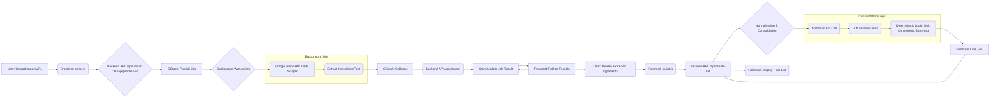

# Recipe-to-Cart: Project Overview

## 1. Project Goal

The primary goal of this application is to allow users to easily convert recipes from various sources (images, URLs) into a consolidated, normalized shopping list suitable for import into grocery platforms or personal use. It aims to handle variations in ingredient descriptions, units, and quantities to produce a sensible, combined list.

## 2. Core Workflow

1.  **Input:** User uploads one or more recipe images OR pastes a recipe URL.
2.  **Initial Processing (Frontend):**
    *   Images: Display previews (if possible).
    *   URLs: Minimal validation.
3.  **Backend Trigger:** Frontend sends image data or URL to the backend (`/api/upload` or `/api/process-url`).
4.  **Asynchronous Analysis (Backend + QStash):**
    *   The backend receives the request and publishes a job to QStash.
    *   For images: The job involves calling Google Cloud Vision API for text extraction (OCR).
    *   For URLs: The job involves scraping the URL for recipe content (ingredients, potentially yield).
    *   This offloads potentially long-running tasks.
5.  **QStash Webhook:** Once the Vision API or scraping task completes, QStash calls a designated backend webhook (`/api/qstash`) with the results (extracted text, ingredients).
6.  **Status Update & Result Display (Backend -> Frontend):**
    *   The webhook handler processes the results.
    *   The frontend polls or uses another mechanism (TBD, likely polling based on current structure) to get the status/results for each recipe source.
    *   Extracted ingredients are displayed per recipe source in the "Extracted Recipes" section.
7.  **Review & Consolidation Trigger (Frontend -> Backend):**
    *   User reviews the extracted ingredients, potentially making minor adjustments (like unchecking pantry items).
    *   User clicks "Review Final List".
    *   Frontend sends the collected (potentially modified) ingredient data from all sources to the `/api/create-list` endpoint.
8.  **Normalization & Consolidation (Backend):**
    *   The `/api/create-list` endpoint receives the raw ingredient list.
    *   **Normalization (V8 Hybrid Approach):** It calls the Anthropic API (Claude Haiku) to get a `normalized_name`, `quantity`, and `unit` for each ingredient string.
    *   **Consolidation:** It uses deterministic logic to:
        *   Convert parsed units to canonical forms (`getCanonicalUnit`).
        *   Convert quantities to target units based on ingredient type (`conversionFactors`, `targetPrimaryUnits`).
        *   Sum quantities for ingredients with the same `normalized_name`.
        *   Apply final adjustments (rounding, minimums, secondary units like lbs for garlic heads).
9.  **Final List Display (Backend -> Frontend):**
    *   The backend responds with the final, consolidated list (`processedIngredients`).
    *   The frontend displays this final shopping list to the user.

## 3. Technology Stack

*   **Frontend:** Vanilla HTML, CSS, JavaScript (`frontend/index.html`, `frontend/style.css`, `frontend/script.js`)
*   **Backend:** Node.js with Express (`backend/server.js`)
*   **Asynchronous Task Queue:** Upstash QStash
*   **Text Extraction (OCR):** Google Cloud Vision API
*   **Ingredient Normalization/Parsing:** Anthropic Claude API (Haiku model)
*   **Deployment:** Vercel (Targeted)

## 4. Project Structure

```
.
├── backend/
│   ├── controllers/      # Request handlers for API routes (listController.js, etc.)
│   ├── services/         # Clients for external APIs (googleVisionService.js, anthropicService.js)
│   ├── utils/            # Helper functions (jsonUtils.js)
│   ├── server.js         # Express server setup, middleware, route definitions
│   └── ...
├── frontend/
│   ├── index.html        # Main HTML structure
│   ├── script.js         # Client-side logic, API calls, UI updates
│   ├── style.css         # Styling
│   └── ...
├── .env                  # Environment variables (local) - NOT COMMITTED
├── .gitignore
├── package.json          # Project dependencies (likely combined F/E & B/E)
├── start_backend.sh      # Script to run backend locally with specific env vars
├── recipe-vision-sa-key.json # Google Service Account Key (local) - NOT COMMITTED
├── PROJECT_OVERVIEW.md   # This file
├── plan.md               # Development planning notes
└── rules.md              # Development guidelines
```

## 5. Backend API Endpoints

*   **`POST /api/upload`**
    *   **Controller:** (Likely `uploadController.js` or similar - TBD)
    *   **Purpose:** Handles uploads of recipe image files.
    *   **Action:** Saves temporary files (or uploads to cloud storage), then publishes a job to QStash containing image reference/data for OCR processing via Google Vision.
    *   **Response:** Returns job identifiers or initial status.
*   **`POST /api/process-url`**
    *   **Controller:** `urlJobController.js` (or similar)
    *   **Purpose:** Handles submission of a recipe URL.
    *   **Action:** Publishes a job to QStash containing the URL for scraping and ingredient extraction.
    *   **Response:** Returns job identifiers or initial status.
*   **`POST /api/qstash`**
    *   **Controller:** (Likely `qstashHandler.js` or integrated into `server.js` - TBD)
    *   **Purpose:** Acts as the webhook endpoint for QStash. Receives results from completed background jobs (Vision OCR or URL scraping).
    *   **Action:** Verifies the QStash signature, parses the job result (extracted text/ingredients), potentially stores/updates job status, makes results available for frontend polling.
    *   **Response:** `200 OK` to QStash on successful verification and processing.
*   **`POST /api/create-list`**
    *   **Controller:** `backend/controllers/listController.js`
    *   **Purpose:** Takes the raw extracted ingredients from multiple sources (provided by the frontend after user review) and performs the final normalization and consolidation.
    *   **Request Body:** `{ ingredients: [{ ingredient: string, quantity?: number, unit?: string, ... }, ...], title?: string }`
    *   **Action:** Implements the V8 Hybrid normalization/consolidation logic (Anthropic call + deterministic processing).
    *   **Response Body:** `{ processedIngredients: [{ name: string, line_item_measurements: [{ unit: string, quantity: number }, ...] }, ...], originalTitle?: string }`

## 6. Key Services & Utilities

*   **`backend/services/googleVisionService.js`:**
    *   Initializes and exports the Google Cloud Vision API client (`ImageAnnotatorClient`).
    *   Handles authentication, crucially supporting both `keyFilename` (local path) and `credentials` (JSON content from env var) based on `GOOGLE_APPLICATION_CREDENTIALS` format.
*   **`backend/services/anthropicService.js`:**
    *   Contains the logic (`callAnthropic`) to interact with the Anthropic Claude API.
    *   Handles constructing the request, making the API call, and returning the raw response, including error handling and retry logic (if implemented).
*   **QStash Integration (Implicit):**
    *   **Publisher:** Code that uses the QStash SDK or API to publish messages (jobs) to a QStash URL (likely in `/api/upload` and `/api/process-url` handlers). Specifies the callback URL (`/api/qstash`).
    *   **Receiver:** Middleware/handler for `/api/qstash` that uses `@upstash/qstash/verify` (or similar) to verify incoming webhook signatures before processing job results.
*   **`backend/utils/jsonUtils.js`:**
    *   Provides robust JSON parsing (`parseAndCorrectJson`), designed to handle potentially malformed or prefixed JSON responses from LLMs.
*   **URL Scraping (Likely in `urlJobController.js` or a dedicated utility):**
    *   Contains logic to fetch HTML content from a given URL and extract recipe ingredients, potentially using libraries like Cheerio or relying on structured data (JSON-LD) if available.

## 7. Data Flow



## 8. Core Challenges & Solutions

*   **Ingredient Normalization & Consolidation:**
    *   **Challenge:** Ingredients appear in highly variable formats ("1 lg onion", "onions, chopped", "1 cup flour", "flour for dusting"). Simple string matching is insufficient for accurate grouping and summing. Unit conversions are complex.
    *   **Solution (V8 Hybrid):**
        1.  **LLM First Pass:** Use Anthropic API (`listController.js`) to parse the raw string into `normalized_name`, `quantity`, and `unit`. This leverages the LLM's language understanding for complex variations.
        2.  **Deterministic Refinement:** Use backend code (`listController.js`) to:
            *   Apply robust unit canonicalization (`getCanonicalUnit`).
            *   Define target consolidation units (`targetPrimaryUnits`).
            *   Use hardcoded conversion factors (`conversionFactors`) for reliable math.
            *   Apply specific rounding rules (`Math.ceil` for countables) and minimums.
            *   Handle fallback scenarios gracefully (using cleaned raw string if LLM fails normalization).
        *   **Rationale:** This balances the LLM's parsing strength with the reliability of code for math and business rules (Ref: `rules.md` Guideline #3).
*   **Asynchronous Processing:**
    *   **Challenge:** Calling external APIs (Vision, Anthropic, URL scraping) can be slow, blocking the request thread and potentially leading to timeouts or poor user experience.
    *   **Solution:** Use QStash as a message queue/task runner. Backend endpoints (`/upload`, `/process-url`) quickly publish jobs to QStash and return. QStash handles execution and calls back `/api/qstash` upon completion. The frontend polls for results.
*   **Credentials Management (Google Vision):**
    *   **Challenge:** Google Cloud client libraries need credentials. Locally, using a service account key file path is common. On deployment platforms like Vercel, using the JSON content stored in an environment variable is preferred.
    *   **Solution:** `googleVisionService.js` checks the `GOOGLE_APPLICATION_CREDENTIALS` environment variable. If it ends in `.json`, it assumes it's a path (resolves it relative to the project) and uses `keyFilename`. Otherwise, it assumes it's JSON content, parses it, and passes it via the `credentials` option.

## 9. Local Development

*   **Environment Variables:** Create a `.env` file in the project root (or `backend` directory if `dotenv` path is set there). See `.env.example` if available, or populate required variables:
    *   `GOOGLE_APPLICATION_CREDENTIALS=../recipe-vision-sa-key.json` (Relative path to your key file)
    *   `ANTHROPIC_API_KEY=sk-...`
    *   `QSTASH_TOKEN=...`
    *   `QSTASH_URL=https://qstash.upstash.io/v1/publish/...`
    *   `QSTASH_CURRENT_SIGNING_KEY=...`
    *   `QSTASH_NEXT_SIGNING_KEY=...`
    *   `APP_BASE_URL=http://localhost:XXXX` (Your local tunnel URL for QStash callbacks)
*   **Credentials File:** Place your downloaded Google Service Account key file (e.g., `recipe-vision-sa-key.json`) in the project root directory (as referenced in the `.env` example). Ensure this file is listed in `.gitignore`.
*   **Running the Backend:** Use the provided script: `sh start_backend.sh`. This script likely sets `NODE_ENV=development` and ensures environment variables (including the SA key path) are correctly loaded.
*   **QStash Tunneling:** QStash needs a public URL to send webhook callbacks to your local machine.
    1.  Start your backend server (e.g., on port `3001`).
    2.  Use a tunneling service like `ngrok` or `cloudflared`:
        *   `ngrok http 3001`
        *   `cloudflared tunnel --url localhost:3001`
    3.  Copy the generated `https://*.ngrok.io` or `https://*.trycloudflare.com` URL.
    4.  Set this URL as the `APP_BASE_URL` environment variable (or configure the QStash publishing code to use it for the callback URL). This ensures QStash sends results back to your running local server via the tunnel.
*   **Dependencies:** Run `npm install` (or `yarn install`).

## 10. Deployment (Vercel)

*   **Environment Variables:** Configure the following environment variables in the Vercel project settings:
    *   `GOOGLE_APPLICATION_CREDENTIALS`: **Paste the entire JSON content** of your service account key file here. Do NOT paste the file path.
    *   `ANTHROPIC_API_KEY`
    *   `QSTASH_TOKEN`
    *   `QSTASH_URL`
    *   `QSTASH_CURRENT_SIGNING_KEY`
    *   `QSTASH_NEXT_SIGNING_KEY`
    *   `VERCEL_URL` (Often provided automatically by Vercel) - Ensure the QStash publishing code uses this (or constructs the appropriate public URL) for the callback URL.
*   **Build Settings:** Configure Vercel build settings appropriately for a Node.js application (e.g., specifying the root directory, build command, output directory if necessary).
*   **Serverless Functions:** Vercel will likely deploy the API routes as serverless functions. Ensure dependencies are correctly bundled. 